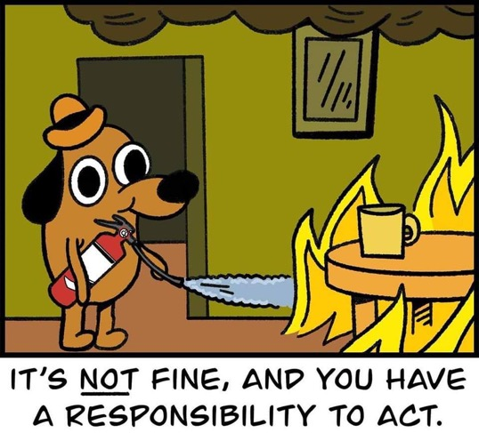

# What if tests fail but it's delivery time, dudes?



## Script

[Egor:]

1. We are not limited by the watching of the tests status, we also can help taking actions
2. We added quality gate to allure3

## What I gotta do to stop 'em

```json
  qualityGate: {
    rules: [
      {
        maxFailures: 2,
        fastFail: true
      },
    ],
  },
```

Or create your own rule!

[Audience:] indistinct chatter...

[A horse snorts nervously in the darkness.]

## Let's try

```shell
./run.sh

```

[NARRATOR:]

- Does he remember to switch to the branch where tests are failing like it's their last day?

## run

```shell
git checkout qg
./run.sh

```


[back to toc](!toc.md/#allure3-highlights)